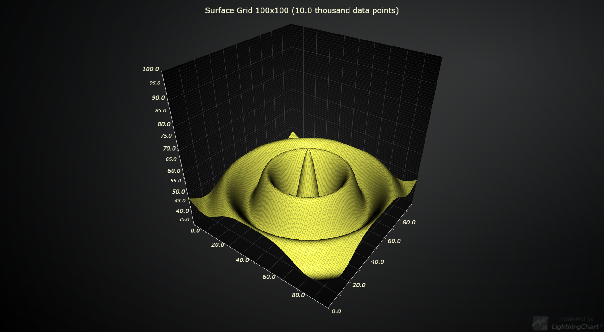
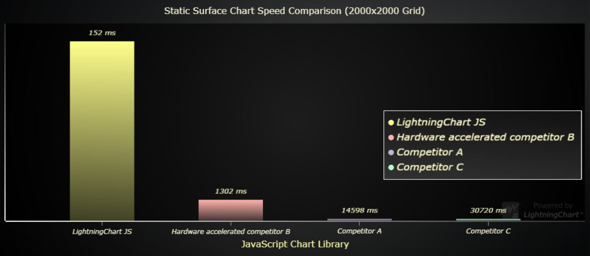
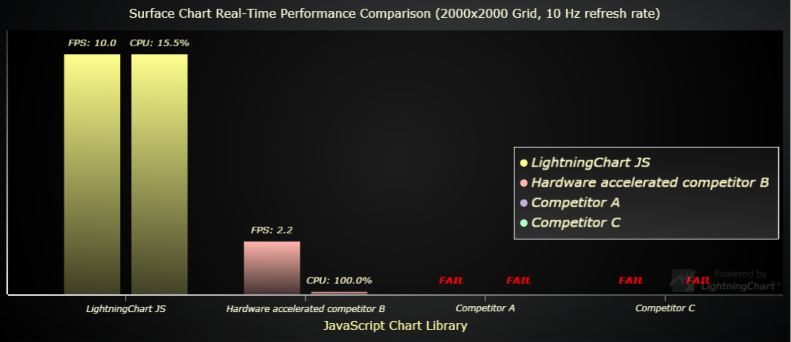
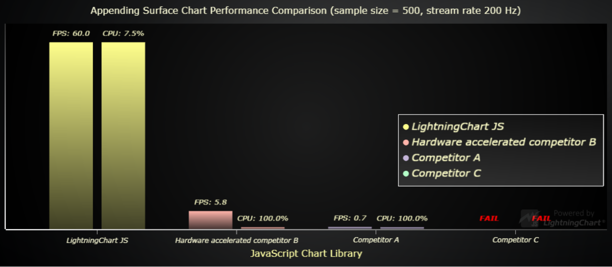

Public comparison of [LightningChart® JS](https://www.arction.com/lightningchart-js/) performance against other JavaScript charting libraries in visualizing different 3D Surface grid charts.

Surface grid charts are used for visualizing of at least 3-dimensional data which exists on a plane (usually referred as X and Z axes). The best way to understand this scenario is visualization of geospatial information, which has latitude (X), longitude (Z) and height (Y) values.

Additionally, surface grid charts are also used in 4-dimensional data visualization by coloring the surface dynamically based on a 4th data dimension.

For testing performance in different types of applications, we have identified 3 different application types of surface grid charts:

1. **Static surface chart**. A height map data set is loaded and rendered as surface chart.

2. **Refreshing surface chart**. In this case, the data is dynamic changing every so often (_refresh rate_). Used in real-time monitoring / analysis of geospatial data.

https://user-images.githubusercontent.com/55391673/143197285-60e5fc5c-38c6-4652-8914-55957cabb03f.mp4

3. **Appending surface chart**. Also dynamic data, but in this case the previous data is not cleared, instead just shifted out as new data is pushed in. Used in audio monitoring and analysis (spectrograms), for example.

https://user-images.githubusercontent.com/55391673/143197699-a8d979c4-d1ef-44a1-9828-0bd893e74b93.mp4

This repository contains performance tests for these 3 application types.

The following chart libraries have been tested:

- [LightningChart® JS v.3.3](https://www.arction.com/lightningchart-js/)
- [ECharts v.5.2.2](http://echarts.apache.org/en/index.html)
- [SciChart JS v.2.0.2115](https://www.scichart.com/javascript-chart-features/)
- [Plotly JS v.2.4.2](https://plotly.com/javascript/)

Competitor results are kept unidentified (for example, "Competitor A").

## Benchmarks

All applications that were created to test performance are included in this repository, open-source (`bench/` folder).
See [Replicating performance benchmarks](#replicating-performance-benchmarks) section to learn more about replicating the results.

The later referenced benchmarks can be found in `bench/benchmarks`. These were measured on 24.11.2021, with an average office PC (Intel Core i7-7700K, 16 GB RAM, AMD Radeon R9 380).

JavaScript chart performance in surface chart applications is measured by gathering different performance metrics from a collection of surface dimensions.

Surface dimensions are specified by the number of columns and rows, for example "100x100" (10 000 data points).

## Static performance comparison breakdown

We have a selected a single test from the set of static performance tests that were run for each included chart library. This test is the same for each library and it highlights the performance differences most effectively.

Here are the results of static surface grid chart test with 2000x2000 data points.

| JavaScript Chart Library | Loading speed (milliseconds) |
|:---|:---|
| LightningChart JS | 152 |
| Hardware accelerated competitor B | 1302 |
| Competitor A with no hardware acceleration | 14598 |
| Competitor C with no hardware acceleration | 30720 |

On average LightningChart JS was **~60x faster** than other charts. However, direct comparison can't be justified in this manner since LightningChart JS reaches much larger data sets than other charts.

| Surface grid size | Non hardware accelerated charts average speed | Hardware accelerated charts speed | LightningChart speed |
|:---|:---|:---|:----|
| 100x100   | 517 ms | 331 ms | **105 ms** | 
| 1000x1000 | 4583 ms | 584 ms | **125 ms** | 
| 2000x2000 | 22659 ms | 1302 ms | **152 ms** | 
| 4000x4000 | Fail | 4838 ms | **232 ms** | 
| 6000x6000 | Fail | 9501 ms | **374 ms** |
| 8000x8000 | Fail | Fail | **614 ms** |
| 10000x10000 | Fail | Fail | **829 ms** |
| 12000x12000 | Fail | Fail | **1260 ms** |

## Refreshing performance comparison breakdown

We have a selected a single test from the set of refreshing performance tests that were run for each included chart library. This test is the same for each library and it highlights the performance differences most effectively.

Here are the results of refreshing (refresh rate = 10 Hz) surface grid chart test with 2000x2000 data points.

| JavaScript Chart Library | Actual refresh rate /s | CPU Usage (%) |
|:---|:---|:---|
| LightningChart JS | 10.0 | 15.5 |
| Hardware accelerated competitor B | 2.2 | 100.0 |
| Competitor A with no hardware acceleration | Fail | Fail |
| Competitor C with no hardware acceleration | Fail | Fail |

Below is a bar chart visualization of this same results table.

To help understand viewers to understand the effects of bad refresh rate and CPU usage measurements we have created a [YouTube video showcasing the charts](https://www.youtube.com/watch?v=eLTY2L2NARg) mentioned here undertaking the refreshing surface chart performance test (**not necessarily with same parameters as the test case highlighted above!**). In this video you can visible see how a low FPS looks on a web page, and respectively how a good FPS looks.

On average, LightningChart JS processed data **430x faster** than non hardware accelerated charts and **18.2x faster** than other hardware accelerated charts.

| JavaScript Chart Library | Max data process speed | Surface grid size | Achieved refresh rate |
|:----|:----|:----|:----|
| LightningChart JS | 160 M/s | 4000x4000 | 10 Hz |
| Hardware accelerated competitor B | 8.8 M/s | 2000x2000 | 2.2 Hz |
| Competitor A with no hardware acceleration | 600 k/s | 500x500 | 10 Hz |
| Competitor C with no hardware acceleration | 148 k/s | 200x200 | 3.7 Hz |

## Appending performance comparison breakdown

We have a selected a single test from the set of appending performance tests that were run for each included chart library. This test is the same for each library and it highlights the performance differences most effectively.

Here are the results of appending surface grid chart test with sample size 500, samples added per second 200 and sample history 10 seconds.

| JavaScript Chart Library | Refresh rate (FPS) | CPU Usage (%) |
|:---|:---|:---|
| LightningChart JS | 60.0 | 7.5 |
| Hardware accelerated competitor B | 5.8 | 100.0 |
| Competitor A with no hardware acceleration | 0.7 | 100.0 |
| Competitor C with no hardware acceleration | Fail | Fail |

Below is a bar chart visualization of this same results table.

To help understand viewers to understand the effects of bad refresh rate and CPU usage measurements we have created a [YouTube video showcasing the charts](https://www.youtube.com/watch?v=mcKHL31nvU0) mentioned here undertaking the appending surface chart performance test (**not necessarily with same parameters as the test case highlighted above!**). In this video you can visible see how a low FPS looks on a web page, and respectively how a good FPS looks.

On average, LightningChart JS could manage appending applications with **1000x more data** than non hardware accelerated charts and **20x more data** than other hardware accelerated charts, while requiring **significantly less CPU power**.

| JavaScript chart library | Heaviest test while keeping FPS > 10 | Incoming data points per second | CPU usage (%) |
|:----|:----|:---|:---|
| LightningChart JS | Sample size: 1000, Stream rate: 200 Hz | 200 000 | **5.3%** |
| Hardware accelerated competitor B | Sample size: 100, Stream rate: 100 Hz | 10 000 | 100.0% |
| Competitor A with no hardware acceleration | Sample size: 100, Stream rate: 10 Hz | 1 000 | 79.0% |
| Competitor C with no hardware acceleration | Sample size: 100, Stream rate: 10 Hz | 1 000 | 100.0% |

## LightningChart JS Surface Chart Capabilities

As you might know, LightningChart JS utilizes hardware acceleration for its graphics. This results in three very particular performance properties:
- **Low CPU usage**
    - As you can see from both highlighted real-time performance scenarios, LightningChart JS is extremely efficient on CPU usage with stark contrast to other chart libraries.
- **High refresh rate**
    - In all highlighted real-time performance scenarios, LightningChart JS refreshes with the maximum required display rate.
- **Hardware scaling**
    - Perhaps something which is not talked about enough; hardware acceleration enables utilizing the power of device graphics processing units (GPU). As a result of this, LightningChart JS performance skyrockets when powerful hardware is used.

It is worth noting, that this is not as simple as "if something is hardware accelerated then it must perform well". There are large differences even between performance of hardware accelerated web charts.

**Let's see what happens when LightningChart JS is used with a powerful machine ...**

We performed a separate test iteration with a more powerful PC (Ryzen 9 5900X, 64GB RAM, RTX 3080) to see what is the maximum capability of LightningChart JS Surface charts. Here's the results!

### Static surface chart

- Maximum data set size: **2 BILLION data points** (45000x45000)
- Massive 10000x10000 surface grid can be loaded in less than a second! (768 ms)
    - This translates to processing ~130 million data points in 1 second.

### Refreshing surface chart

- **LightningChart JS officially enables real-time refreshing surface data visualization**. From the performance results of older data visualization tools, it can be seen that they are simply not efficient enough with CPU usage to allow this kind of applications. Here is one performance test result we'd like to highlight:

| JavaScript chart library | Refresh rate (Hz) | Surface grid dimensions | Total data points per refresh | Achieved refresh rate (FPS) | CPU usage (%) |
|:---|:----|:----|:----|:----|:---|
| LightningChart JS | 60 | 1000x1000 | 1 million | **60.0** | **16.0%** | 

In this test, a surface data set is refreshed 60 times per second. This is the most common maximum refresh rate of computer monitors, thus a very commonly used refresh rate in monitoring solutions.

Note, the CPU usage from LightningChart JS: **16.0 %**. This leaves plenty of power for the rest of the web page as well as something often forgotten before it is a problem: transferring the data to the data visualization application, as well as possible data analysis computations.

### Appending surface chart

- **LightningChart JS officially enables real-time appending surface data visualization**. From the performance results of older data visualization tools, it can be seen that they are simply not efficient enough with CPU usage to allow this kind of applications. 

**Why is this?**

Most importantly, this is due to design decisions. All other chart solutions that we tested only allowed following actions:
- Create surface chart with X data set.
- Update existing surface chart with X data set.

However, this is not applicable to appending surface charts because of several reasons:

1. User is responsible for appending data and shifting old data out.
    - This means that actually users are implementing a significant part of the data processing.

2. Data update is not optimized.
    - Even if only one sample is added to the surface, it results in the entire chart being updated as if the whole data set was changed.
    - This will NEVER perform on an acceptable level in real-time applications.

**How does LightningChart resolve this issue?**

From the start, LightningChart JS was designed to work in all real-time applications. For this reason, we have a dedicated surface chart feature, which handles all the above mentioned processes internally, while user only has to push in new samples to append.

...and here is how it performs with a fast machine:

| JavaScript chart library | Surface grid dimensions | New data points per second | Achieved refresh rate (FPS) | CPU usage (%) |
|:---|:----|:----|:----|:----|
| LightningChart JS | 2000x1000 | 200 thousand | **55.0** | **2.5%** | 

This is an extremely heavy application, with each sample having 2000 data values and displaying time domain history from 10 seconds with 100 new samples added per second.

In practice, this should cover any realistic need for 3D spectrogram data visualization applications, which are usually limited by sample size and refresh rate.

## End word

Read more about Lightning Chart JS performance why and how at our [web site](https://www.arction.com/high-performance-javascript-charts/).

To interact with LightningChart JS Surface charts, please continue in our [Surface chart examples gallery](https://www.arction.com/lightningchart-js-interactive-examples/search.html?t=surface).

## Replicating performance benchmarks

The benchmark applications and all related resources can be found in `bench/` folder.

Please see [bench/README.md](bench/README.md) for development instructions.
